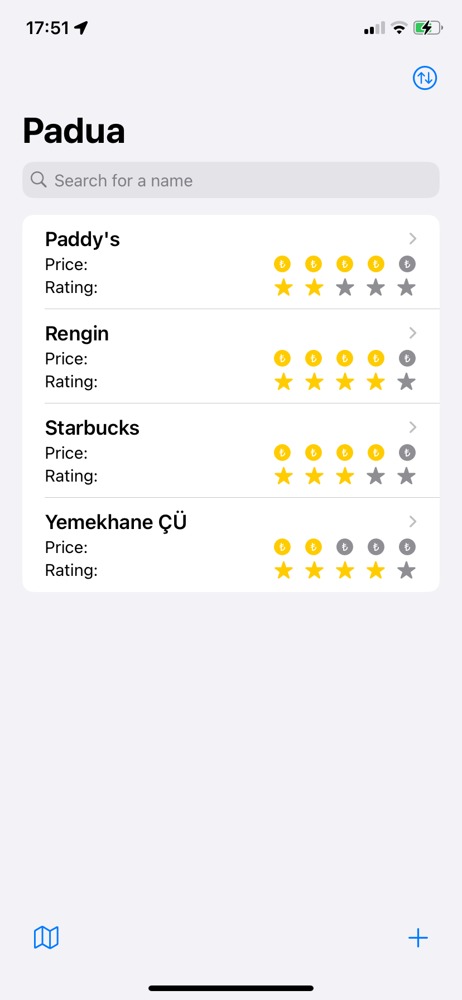
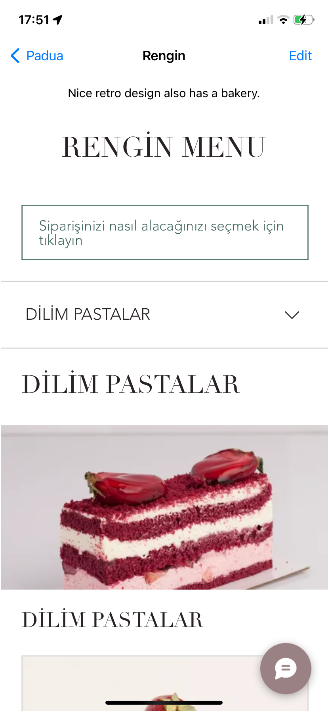

  

<h3 align="center">Padua</h3>

  

    Padua is an iOS app that scans QR codes for restaurant and cafe menus, display the menus, save and organize obtained links 
    tagged with user locations to be accessed before visiting the places to plan budget with the up-to-date prices and also 
    save personal notes and ratings for previously visited places.
  

  
  
  

